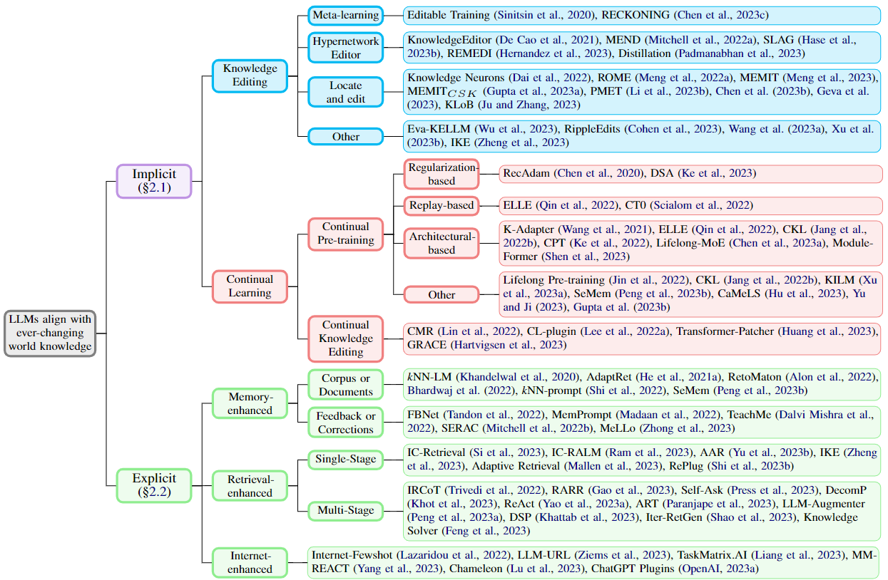
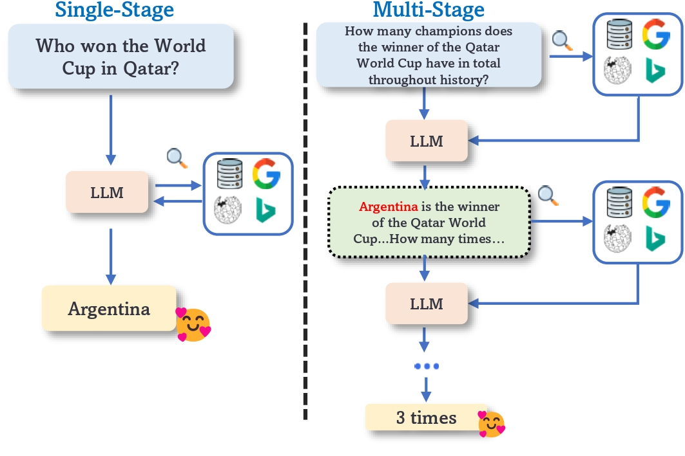

# Awesome-Refreshing-LLMs <!-- omit from toc -->

Although **large language models (LLMs)** are impressive in solving various tasks, they can quickly be outdated after deployment. Maintaining their up-to-date status is a pressing concern in the current era. How can we refresh LLMs to align with the ever-changing world knowledge ***without expensive retraining from scratch***?

    
     
    <em>An LLM after training is static and can be quickly outdated. For example, <a href="https://openai.com/blog/chatgpt" target="_blank">ChatGPT</a> has a knowledge   cutoff date of September 2021. Without <a href="https://openai.com/blog/chatgpt-plugins" target="_blank">web browsing</a>, it does not know the latest information ever since.</em>

## 📢 News
- **[2023-10] Our survey paper: *"How Do Large Language Models Capture the Ever-changing World Knowledge? A Review of Recent Advances"* has been accepted by [EMNLP 2023](https://2023.emnlp.org/)! We will release the camera-ready version soon.**
- **[2023-10] We create this repository to maintain a paper list on *refreshing LLMs without retraining*.**

---

## 🔍 Table of Contents

- [📢 News](#-news)
- [🔍 Table of Contents](#-table-of-contents)
- [📃 Papers](#-papers)
  - [Methods Overview](#methods-overview)
  - [Knowledge Editing](#knowledge-editing)
    - [Meta-learning](#meta-learning)
    - [Hypernetwork Editor](#hypernetwork-editor)
    - [Locate and Edit](#locate-and-edit)
  - [Continual Learning](#continual-learning)
    - [Continual Pre-training](#continual-pre-training)
    - [Continual Knowledge Editing](#continual-knowledge-editing)
  - [Memory-enhanced](#memory-enhanced)
  - [Retrieval-enhanced](#retrieval-enhanced)
  - [Internet-enhanced](#internet-enhanced)
- [💻 Resources](#-resources)
  - [Related Survey](#related-survey)
  - [Tools](#tools)
- [🚩 Citation](#-citation)
- [🎉 Acknowledgement \& Contribution](#-acknowledgement--contribution)

## 📃 Papers

### Methods Overview

To refresh LLMs to align with the ever-changing world knowledge without retraining, we roughly categorize existing methods into ***Implicit*** and ***Explicit*** approaches.
***Implicit*** means the approaches seek to directly alter the knowledge stored in LLMs, such as parameters or weights, while ***Explicit*** means more often incorporating external resources to override internal knowledge, such as augmenting a search engine.

Please see our paper for more details.

    
     
    <em>Taxonomy of methods to align LLMs with the ever-changing world knowledge.</em>

    
     
    <em>A high-level comparison of different approaches.</em>

### Knowledge Editing

> **Knowledge editing (KE)** is an arising and promising research area that aims to alter the parameters of some specific knowledge stored in pre-trained models so that the model can make new predictions on those revised instances while keeping other irrelevant knowledge unchanged. 
> We categorize existing methods into *meta-learning*, *hypernetwork*, and *locate-and-edit* -based methods.

#### Meta-learning

| Year | Venue | Paper                                                   | Link                                                                                                                                                                                                                                                         |
| :--- | :---- | :------------------------------------------------------ | :----------------------------------------------------------------------------------------------------------------------------------------------------------------------------------------------------------------------------------------------------------- |
| 2023 | Arxiv | RECKONING: Reasoning through Dynamic Knowledge Encoding |                                                                                                                                  |
| 2020 | ICLR  | Editable Neural Networks                                |   |

#### Hypernetwork Editor

| Year | Venue | Paper                                                                               | Link                                                                                                                                                                                                                                                                |
| :--- | :---- | :---------------------------------------------------------------------------------- | :------------------------------------------------------------------------------------------------------------------------------------------------------------------------------------------------------------------------------------------------------------------ |
| 2023 | Arxiv | Inspecting and Editing Knowledge Representations in Language Models                 |                                |
| 2023 | EACL  | Methods for Measuring, Updating, and Visualizing Factual Beliefs in Language Models |   |
| 2022 | ICLR  | Fast Model Editing at Scale                                                         |                 |
| 2021 | EMNLP | Editing Factual Knowledge in Language Models                                        |     |

#### Locate and Edit

| Year | Venue   | Paper                                        | Link                                                                                                                                                                                                                                                                                                                     |
| :--- | :------ | :------------------------------------------- | :----------------------------------------------------------------------------------------------------------------------------------------------------------------------------------------------------------------------------------------------------------------------------------------------------------------------- |
| 2023 | Arxiv   | Editing Commonsense Knowledge in GPT         |                                                                                 |
| 2023 | ICLR    | Mass-Editing Memory in a Transformer         |                                                                           |
| 2022 | ACL     | Knowledge Neurons in Pretrained Transformers |                                                            |
| 2022 | NeurIPS | Fast Model Editing at Scale                  |   |

### Continual Learning

> **Continual learning (CL)** aims to enable a model to learn from a continuous data stream across time while reducing catastrophic forgetting of previously acquired knowledge. With CL, a deployed LLM has the potential to adapt to the changing world without costly re-training from scratch. Below papers employ CL for aligning language models with the current world knowledge, including *Continual Pre-training* and *Continual Knowledge Editing*.

#### Continual Pre-training

| Year | Venue   | Paper                                                                                           | Link                                                                                                                                                                                                                                                                                                                                                               |
| :--- | :------ | :---------------------------------------------------------------------------------------------- | :----------------------------------------------------------------------------------------------------------------------------------------------------------------------------------------------------------------------------------------------------------------------------------------------------------------------------------------------------------------- |
| 2023 | Arxiv   | KILM: Knowledge Injection into Encoder-Decoder Language Models                                  |                                                                                                                                   |
| 2023 | Arxiv   | Semiparametric Language Models Are Scalable Continual Learners                                  |                                                                                                                                                                                                                                        |
| 2023 | Arxiv   | Meta-Learning Online Adaptation of Language Models                                              |                                                                                                                                                                                                                                        |
| 2023 | ICLR    | Continual Pre-training of Language Models                                                       |                                                                                                           |
| 2023 | ICML    | Lifelong Language Pretraining with Distribution-Specialized Experts                             |                                                                                                                                                                                                                                        |
| 2022 | ACL     | ELLE: Efficient Lifelong Pre-training for Emerging Data                                         |                                                                                                                   |
| 2022 | EMNLP   | Fine-tuned Language Models are Continual Learners                                               |                                                                                             |
| 2022 | EMNLP   | Continual Training of Language Models for Few-Shot Learning                                     |                                                                                                                 |
| 2022 | EMNLP   | TemporalWiki: A Lifelong Benchmark for Training and Evaluating Ever-Evolving Language Models    |                                                                                                           |
| 2022 | ICLR    | LoRA: Low-Rank Adaptation of Large Language Models                                              |                                                                                                                    |
| 2022 | ICLR    | Towards Continual Knowledge Learning of Language Models                                         |                                                                                             |
| 2022 | NAACL   | DEMix Layers: Disentangling Domains for Modular Language Modeling                               |                                                                                                             |
| 2022 | NAACL   | Lifelong Pretraining: Continually Adapting Language Models to Emerging Corpora                  |                                                                                                                                                                                                                           |
| 2022 | NeurIPS | Factuality Enhanced Language Models for Open-Ended Text Generation                              |                                                                                                                  |
| 2022 | TACL    | Time-Aware Language Models as Temporal Knowledge Bases                                          |   |
| 2021 | ACL     | K-Adapter: Infusing Knowledge into Pre-Trained Models with Adapters                             |                                                                                                           |
| 2021 | EACL    | Analyzing the Forgetting Problem in Pretrain-Finetuning of Open-domain Dialogue Response Models |                                                                                                                                                                                                                             |
| 2020 | EMNLP   | Recall and Learn: Fine-tuning Deep Pretrained Language Models with Less Forgetting              |                                                                                                            |

#### Continual Knowledge Editing

| Year | Venue | Paper                                                                     | Link                                                                                                                                                                                                                                                              |
| :--- | :---- | :------------------------------------------------------------------------ | :---------------------------------------------------------------------------------------------------------------------------------------------------------------------------------------------------------------------------------------------------------------- |
| 2023 | Arxiv | Aging with GRACE: Lifelong Model Editing with Discrete Key-Value Adapters |                           |
| 2023 | ICLR  | Transformer-Patcher: One Mistake Worth One Neuron                         |   |
| 2022 | ACL   | On Continual Model Refinement in Out-of-Distribution Data Streams         |             |
| 2022 | ACL   | Plug-and-Play Adaptation for Continuously-updated QA                      |                                                                                                                         |

### Memory-enhanced

> Pairing a static LLM with a growing **non-parametric memory** enables it to capture information beyond its memorized knowledge during inference. The external memory can store a recent *corpus* or *feedback* that contains new information to guide the model generation.

| Year | Venue | Paper                                                                                                         | Link                                                                                                                                                                                                                                                        |
| :--- | :---- | :------------------------------------------------------------------------------------------------------------ | :---------------------------------------------------------------------------------------------------------------------------------------------------------------------------------------------------------------------------------------------------------- |
| 2023 | Arxiv | Adaptation Approaches for Nearest Neighbor Language Models                                                    |                                                                                                                                 |
| 2023 | Arxiv | Semiparametric Language Models Are Scalable Continual Learners                                                |                                                                                                                                 |
| 2023 | Arxiv | MQuAKE: Assessing Knowledge Editing in Language Models via Multi-Hop Questions                                |                  |
| 2022 | EMNLP | You can’t pick your neighbors, or can you? When and How to Rely on Retrieval in the kNN-LM                    |                                                                                                                |
| 2022 | EMNLP | Nearest Neighbor Zero-Shot Inference                                                                          |       |
| 2022 | EMNLP | Memory-assisted prompt editing to improve GPT-3 after deployment                                              |         |
| 2022 | EMNLP | Towards Teachable Reasoning Systems: Using a Dynamic Memory of User Feedback for Continual System Improvement |            |
| 2022 | ICML  | Neuro-Symbolic Language Modeling with Automaton-augmented Retrieval                                           |                      |
| 2022 | ICML  | Memory-Based Model Editing at Scale                                                                           |                   |
| 2022 | NAACL | Learning to repair: Repairing model output errors after deployment using a dynamic memory of feedback         |   |
| 2021 | EMNLP | Efficient Nearest Neighbor Language Models                                                                    |     |
| 2021 | EMNLP | BeliefBank: Adding Memory to a Pre-Trained Language Model for a Systematic Notion of Belief                   |                                                                                                                    |
| 2020 | ICLR  | Generalization through Memorization: Nearest Neighbor Language Models                                         |              |

### Retrieval-enhanced

> Leveraging an off-the-shelf retriever and the in-context learning ability of LLMs, this line of work designs better retrieval strategies to incorporate world knowledge into a fixed LLM through prompting, which can be divided into *single-stage* and *multi-stage*.

    
     
    <em>Single-Stage (left) typically retrieves once, while Multi-Stage (right) involves multiple retrievals or revisions to solve complex questions</em>

| Year | Venue | Paper                                                                                                          | Link                                                                                                                                                                                                                                                             |
| :--- | :---- | :------------------------------------------------------------------------------------------------------------- | :--------------------------------------------------------------------------------------------------------------------------------------------------------------------------------------------------------------------------------------------------------------- |
| 2023 | ACL   | Augmentation-Adapted Retriever Improves Generalization of Language Models as Generic Plug-In                   |   |
| 2023 | ACL   | When Not to Trust Language Models: Investigating Effectiveness of Parametric and Non-Parametric Memories       |             |
| 2023 | ACL   | Interleaving Retrieval with Chain-of-Thought Reasoning for Knowledge-Intensive Multi-Step Questions            |                        |
| 2023 | ACL   | RARR: Researching and Revising What Language Models Say, Using Language Models                                 |                          |
| 2023 | ACL   | MultiTool-CoT: GPT-3 Can Use Multiple External Tools with Chain of Thought Prompting                           |                 |
| 2023 | Arxiv | Can We Edit Factual Knowledge by In-Context Learning?                                                          |                            |
| 2023 | Arxiv | REPLUG: Retrieval-Augmented Black-Box Language Models                                                          |                                                                                                                                      |
| 2023 | Arxiv | Improving Language Models via Plug-and-Play Retrieval Feedback                                                 |                                                                                                                                      |
| 2023 | Arxiv | Measuring and Narrowing the Compositionality Gap in Language Models                                            |                         |
| 2023 | Arxiv | ART: Automatic multi-step reasoning and tool-use for large language models                                     |     |
| 2023 | Arxiv | ChatCoT: Tool-Augmented Chain-of-Thought Reasoning on Chat-based Large Language Models                         |                           |
| 2023 | Arxiv | Check Your Facts and Try Again: Improving Large Language Models with External Knowledge and Automated Feedback |                   |
| 2023 | Arxiv | Question Answering as Programming for Solving Time-Sensitive Questions                                         |    |
| 2023 | Arxiv | Active Retrieval Augmented Generation                                                                          |                               |
| 2023 | Arxiv | Demonstrate-Search-Predict: Composing retrieval and language models for knowledge-intensive NLP                |                           |
| 2023 | Arxiv | Enhancing Retrieval-Augmented Large Language Models with Iterative Retrieval-Generation Synergy                |                                                                                                                                      |
| 2023 | Arxiv | Verify-and-Edit: A Knowledge-Enhanced Chain-of-Thought Framework                                               |                                                                                                                                      |
| 2023 | Arxiv | CRITIC: Large Language Models Can Self-Correct with Tool-Interactive Critiquing                                |    |
| 2023 | Arxiv | WikiChat: A Few-Shot LLM-Based Chatbot Grounded with Wikipedia                                                 |                                                                                                                                      |
| 2023 | Arxiv | Query Rewriting for Retrieval-Augmented Large Language Models                                                  |                                                                                                                                      |
| 2023 | ICLR  | Prompting GPT-3 To Be Reliable                                                                                 |        |
| 2023 | ICLR  | Decomposed Prompting: A Modular Approach for Solving Complex Tasks                                             |                  |
| 2023 | ICLR  | ReAct: Synergizing Reasoning and Acting in Language Models                                                     |                   |
| 2023 | TACL  | In-Context Retrieval-Augmented Language Models                                                                 |                   |
| 2022 | Arxiv | Rethinking with Retrieval: Faithful Large Language Model Inference                                             |                               |

### Internet-enhanced

> A recent trend uses the whole web as the knowledge source and equips LLMs with the **Internet** to support real-time information seeking.

| Year | Venue | Paper                                                                                            | Link                                                                                                                                                                                                                                                                 |
| :--- | :---- | :----------------------------------------------------------------------------------------------- | :------------------------------------------------------------------------------------------------------------------------------------------------------------------------------------------------------------------------------------------------------------------- |
| 2023 | ACL   | Large Language Models are Built-in Autoregressive Search Engines                                 |                                  |
| 2023 | ACL   | RARR: Researching and Revising What Language Models Say, Using Language Models                   |                              |
| 2023 | Arxiv | Measuring and Narrowing the Compositionality Gap in Language Models                              |                             |
| 2023 | Arxiv | ART: Automatic multi-step reasoning and tool-use for large language models                       |         |
| 2023 | Arxiv | TaskMatrix.AI: Completing Tasks by Connecting Foundation Models with Millions of APIs            |   |
| 2023 | Arxiv | MM-REACT: Prompting ChatGPT for Multimodal Reasoning and Action                                  |                             |
| 2023 | Arxiv | Active Retrieval Augmented Generation                                                            |                                   |
| 2023 | Arxiv | Chameleon: Plug-and-Play Compositional Reasoning with Large Language Models                      |                        |
| 2023 | Arxiv | CRITIC: Large Language Models Can Self-Correct with Tool-Interactive Critiquing                  |        |
| 2023 | Arxiv | Query Rewriting for Retrieval-Augmented Large Language Models                                    |                                                                                                                                          |
| 2023 | ICLR  | ReAct: Synergizing Reasoning and Acting in Language Models                                       |                       |
| 2022 | Arxiv | Internet-augmented language models through few-shot prompting for open-domain question answering |                                                                                                                                          |

## 💻 Resources

### Related Survey

- [Augmented Language Models: a Survey](https://arxiv.org/abs/2302.07842), 2023
- [The Life Cycle of Knowledge in Big Language Models: A Survey](https://arxiv.org/abs/2303.07616), 2023
- [Interactive Natural Language Processing](https://arxiv.org/abs/2305.13246), 2023
- [Editing Large Language Models: Problems, Methods, and Opportunities](https://arxiv.org/abs/2305.13172), 2023
- [Tool Learning with Foundation Models](https://arxiv.org/abs/2304.08354), 2023
- [Unifying Large Language Models and Knowledge Graphs: A Roadmap](https://arxiv.org/abs/2306.08302), 2023
- [A Review on Language Models as Knowledge Bases](https://arxiv.org/abs/2204.06031), 2022
- [A Survey of Knowledge-enhanced Text Generation](https://dl.acm.org/doi/10.1145/3512467), 2022
- [A Survey of Knowledge-Intensive NLP with Pre-Trained Language Models](https://arxiv.org/abs/2202.08772), 2022
- [A Survey on Knowledge-Enhanced Pre-trained Language Models](https://arxiv.org/abs/2212.13428), 2022
- [Retrieving and Reading: A Comprehensive Survey on Open-domain Question Answering](https://arxiv.org/abs/2101.00774), 2021
- [Knowledge Enhanced Pretrained Language Models: A Compreshensive Survey](https://arxiv.org/abs/2110.08455), 2021

### Tools

- [LangChain](https://github.com/langchain-ai/langchain): a framework for developing applications powered by language models. 
- [ChatGPT plugins](https://openai.com/blog/chatgpt-plugins): designed specifically for language models with safety as a core principle, and help ChatGPT access up-to-date information, run computations, or use third-party services.
- [EasyEdit](https://github.com/zjunlp/EasyEdit): an Easy-to-use Knowledge Editing Framework for LLMs.
- [FastEdit](https://github.com/hiyouga/FastEdit): injecting fresh and customized knowledge into large language models efficiently using one single command.
- [PyContinual](https://github.com/ZixuanKe/PyContinual): an Easy and Extendible Framework for Continual Learning.
- [Avalanche](https://github.com/ContinualAI/avalanche): an End-to-End Library for Continual Learning based on PyTorch.

## 🚩 Citation

If our research helps you, please kindly cite our paper.

## 🎉 Acknowledgement & Contribution

This field is evolving very fast, and we may miss important works. Please don't hesitate to share your work.
Pull requests are always welcome if you spot anything wrong (e.g., broken links, typos, etc.) or share new papers! 
We thank all contributors for their valuable efforts.

